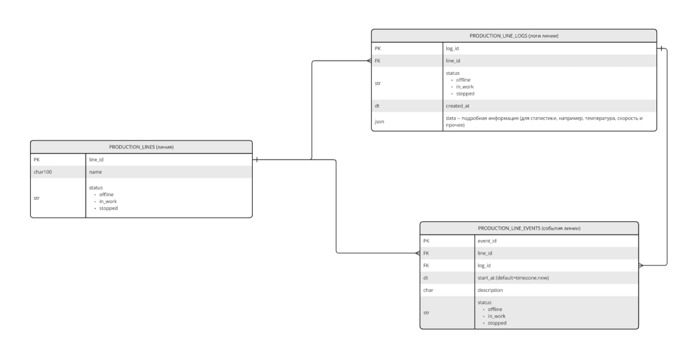

# 🚀 Service FastAPI для работы с производственной линией

Система работы с логами о простоях на производственной линии, основанная на фреймворке FastAPI.

## 📦 Содержание

- [🗂️ Архитектура базы данных](#-архитектура-базы-данных)
- [🚀 Установка и запуск](#-установка-и-запуск)
- [🧪 Тестирование](#-тестирование)
- [📁 Структура проекта](#-структура-проекта)
--[📊 Анализ качества кода (на основе Pylint)]

Утилита `Pylint` была использована для автоматической оценки качества исходного кода модуля `app.py`.

## 🗂️ Архитектура базы данных



## 🚀 Установка и запуск

### 1. Клонирование репозитория

```bash
git clone https://github.com/Alexiszen24/service-fastapi.git
cd service-fastapi


### 2. Создание виртуального окружения

```bash
python -m venv venv
source venv/bin/activate  # Для Windows: venv\\Scripts\\activate
```

### 3. Установка зависимостей

```bash
pip install -r requirements.txt
```

### 4. Запуск сервера

```bash
uvicorn main:app --reload
```

Сервер будет доступен по адресу:  
[http://127.0.0.1:8000](http://127.0.0.1:8000)

Документация Swagger UI:  
[http://127.0.0.1:8000/docs](http://127.0.0.1:8000/docs)

---

## 🧪 Тестирование

Для запуска тестов (если они добавлены):

```bash
pytest
```

Убедитесь, что зависимости для тестирования установлены.

---

## 📁 Структура проекта

```text
service-fastapi/
├── app/
│   ├── main.py          # Точка входа в приложение
│   ├── routers/         # Маршруты приложения
│   ├── models/          # Модели данных
│   ├── services/        # Бизнес-логика
│   └── utils/           # Утилиты и вспомогательные функции
├── tests/               # Тесты
├── requirements.txt     # Зависимости проекта
├── README.md            # Документация проекта
└── .gitignore           # Исключения для Git
```
---

## 📊 Анализ качества кода (на основе Pylint)

Your code has been rated at 6.52/10

Утилита `Pylint` была использована для автоматической оценки качества исходного кода модуля `app.py`.
************* Module app.db
db.py:5:0: C0301: Line too long (102/100) (line-too-long)
db.py:6:0: C0301: Line too long (116/100) (line-too-long)
db.py:1:0: C0114: Missing module docstring (missing-module-docstring)
db.py:11:0: C0116: Missing function or method docstring (missing-function-docstring)
db.py:30:0: C0116: Missing function or method docstring (missing-function-docstring)
db.py:2:0: C0411: third party import "sqlmodel.create_engine" should be placed before first party import "app.config.settings"  (wrong-import-order)
db.py:3:0: C0411: third party import "sqlalchemy.ext.asyncio.create_async_engine" should be placed before first party import "app.config.settings"  (wrong-import-order)
************* Module app.config
config.py:1:0: C0114: Missing module docstring (missing-module-docstring)
config.py:4:0: C0115: Missing class docstring (missing-class-docstring)
************* Module app.main
main.py:4:0: C0301: Line too long (102/100) (line-too-long)
main.py:10:0: C0301: Line too long (102/100) (line-too-long)
main.py:1:0: C0114: Missing module docstring (missing-module-docstring)
************* Module app.auth
auth/__init__.py:1:0: C0114: Missing module docstring (missing-module-docstring)
auth/__init__.py:20:0: C0116: Missing function or method docstring (missing-function-docstring)
auth/__init__.py:24:0: C0116: Missing function or method docstring (missing-function-docstring)
auth/__init__.py:28:0: C0116: Missing function or method docstring (missing-function-docstring)
auth/__init__.py:46:0: C0116: Missing function or method docstring (missing-function-docstring)
auth/__init__.py:59:8: W0707: Consider explicitly re-raising using 'except InvalidTokenError as exc' and 'raise credentials_exception from exc' (raise-missing-from)
auth/__init__.py:3:0: C0411: standard import "datetime.datetime" should be placed before third party import "jwt" (wrong-import-order)
auth/__init__.py:5:0: C0411: standard import "typing.Annotated" should be placed before third party imports "jwt", "jwt.exceptions.InvalidTokenError" (wrong-import-order)
************* Module app.constants
constants/__init__.py:1:0: C0114: Missing module docstring (missing-module-docstring)
constants/__init__.py:4:0: C0115: Missing class docstring (missing-class-docstring)
************* Module app.schemas
schemas/__init__.py:1:0: C0114: Missing module docstring (missing-module-docstring)
schemas/__init__.py:11:0: C0115: Missing class docstring (missing-class-docstring)
schemas/__init__.py:28:0: C0115: Missing class docstring (missing-class-docstring)
schemas/__init__.py:50:0: C0115: Missing class docstring (missing-class-docstring)
schemas/__init__.py:56:0: C0115: Missing class docstring (missing-class-docstring)
schemas/__init__.py:59:68: W0108: Lambda may not be necessary (unnecessary-lambda)
schemas/__init__.py:64:0: C0115: Missing class docstring (missing-class-docstring)
schemas/__init__.py:68:66: W0108: Lambda may not be necessary (unnecessary-lambda)
schemas/__init__.py:73:4: C0116: Missing function or method docstring (missing-function-docstring)
schemas/__init__.py:77:0: C0115: Missing class docstring (missing-class-docstring)
schemas/__init__.py:82:0: C0115: Missing class docstring (missing-class-docstring)
schemas/__init__.py:86:0: C0115: Missing class docstring (missing-class-docstring)
schemas/__init__.py:90:0: C0115: Missing class docstring (missing-class-docstring)
schemas/__init__.py:97:0: C0115: Missing class docstring (missing-class-docstring)
schemas/__init__.py:102:0: C0115: Missing class docstring (missing-class-docstring)
schemas/__init__.py:110:0: C0115: Missing class docstring (missing-class-docstring)
schemas/__init__.py:119:0: C0115: Missing class docstring (missing-class-docstring)
schemas/__init__.py:126:0: C0115: Missing class docstring (missing-class-docstring)
schemas/__init__.py:130:0: C0115: Missing class docstring (missing-class-docstring)
schemas/__init__.py:4:0: C0411: standard import "typing.Optional" should be placed before third party imports "pydantic.BaseModel", "pydantic_settings.SettingsConfigDict" (wrong-import-order)
************* Module app.api_docs
api_docs/__init__.py:1:0: C0114: Missing module docstring (missing-module-docstring)
************* Module app.api_docs.request_examples
api_docs/request_examples.py:22:0: C0304: Final newline missing (missing-final-newline)
api_docs/request_examples.py:1:0: C0114: Missing module docstring (missing-module-docstring)
************* Module app.routes.auth
routes/auth.py:1:0: C0114: Missing module docstring (missing-module-docstring)
routes/auth.py:23:0: C0116: Missing function or method docstring (missing-function-docstring)
routes/auth.py:36:8: W0707: Consider explicitly re-raising using 'except IntegrityError as exc' and 'raise HTTPException(status_code=status.HTTP_422_UNPROCESSABLE_ENTITY, detail=f'User with email {user.email} already exists') from exc' (raise-missing-from)
routes/auth.py:44:0: C0116: Missing function or method docstring (missing-function-docstring)
routes/auth.py:56:4: R1705: Unnecessary "else" after "return", remove the "else" and de-indent the code inside it (no-else-return)
routes/auth.py:12:0: C0411: standard import "datetime.timedelta" should be placed before third party imports "fastapi.APIRouter", "fastapi.security.oauth2.OAuth2PasswordRequestForm", "sqlmodel.Session", "sqlalchemy.exc.IntegrityError" and first party imports "app.schemas", "app.db.get_session", "app.auth.verify_password", "app.config.settings"  (wrong-import-order)
routes/auth.py:1:0: W0611: Unused Annotated imported from typing (unused-import)
routes/auth.py:4:0: W0611: Unused OAuth2PasswordRequestForm imported from fastapi.security.oauth2 (unused-import)
************* Module app.routes.events
routes/events.py:19:0: C0301: Line too long (116/100) (line-too-long)
routes/events.py:1:0: C0114: Missing module docstring (missing-module-docstring)
routes/events.py:19:0: C0116: Missing function or method docstring (missing-function-docstring)
routes/events.py:25:19: W1309: Using an f-string that does not have any interpolated variables (f-string-without-interpolation)
routes/events.py:42:0: C0116: Missing function or method docstring (missing-function-docstring)
routes/events.py:45:8: W0613: Unused argument 'current_user' (unused-argument)
routes/events.py:4:0: W0611: Unused select imported from sqlalchemy (unused-import)
routes/events.py:9:0: W0611: Unused LineEvent imported from app.schemas (unused-import)
************* Module app.routes.lines
routes/lines.py:35:0: C0301: Line too long (102/100) (line-too-long)
routes/lines.py:65:0: C0301: Line too long (109/100) (line-too-long)
routes/lines.py:1:0: C0114: Missing module docstring (missing-module-docstring)
routes/lines.py:35:0: C0116: Missing function or method docstring (missing-function-docstring)
routes/lines.py:47:0: C0116: Missing function or method docstring (missing-function-docstring)
routes/lines.py:65:0: C0116: Missing function or method docstring (missing-function-docstring)
routes/lines.py:86:0: C0116: Missing function or method docstring (missing-function-docstring)
routes/lines.py:7:0: C0411: standard import "typing.List" should be placed before third party imports "fastapi.APIRouter", "sqlalchemy.select", "sqlmodel.Session" and first party imports "app.db.get_session", "app.schemas.Line"  (wrong-import-order)
routes/lines.py:2:0: W0611: Unused select imported from sqlalchemy (unused-import)
routes/lines.py:6:0: W0611: Unused Line imported from app.schemas (unused-import)
routes/lines.py:7:0: W0611: Unused List imported from typing (unused-import)
************* Module app.routes.utils
routes/utils.py:1:0: C0114: Missing module docstring (missing-module-docstring)
routes/utils.py:15:0: C0116: Missing function or method docstring (missing-function-docstring)
routes/utils.py:22:0: C0116: Missing function or method docstring (missing-function-docstring)
routes/utils.py:22:0: E0102: function already defined line 15 (function-redefined)
routes/utils.py:31:0: C0116: Missing function or method docstring (missing-function-docstring)
routes/utils.py:37:0: C0116: Missing function or method docstring (missing-function-docstring)
routes/utils.py:8:0: C0411: third party import "fastapi.security.OAuth2PasswordBearer" should be placed before first party imports "app.auth.get_current_user", "app.db.get_session", "app.schemas.User"  (wrong-import-order)
routes/utils.py:9:0: C0411: standard import "typing.Annotated" should be placed before third party imports "fastapi.APIRouter", "sqlalchemy.text", "sqlmodel.Session", "fastapi.security.OAuth2PasswordBearer" and first party imports "app.auth.get_current_user", "app.db.get_session", "app.schemas.User"  (wrong-import-order)
routes/utils.py:8:0: C0412: Imports from package fastapi are not grouped (ungrouped-imports)
************* Module app.routes.logs
routes/logs.py:1:0: C0114: Missing module docstring (missing-module-docstring)
routes/logs.py:7:0: C0411: standard import "typing.List" should be placed before third party imports "fastapi.APIRouter", "sqlalchemy.select", "sqlmodel.Session" and first party imports "app.db.get_session", "app.schemas.Line"  (wrong-import-order)
routes/logs.py:1:0: W0611: Unused HTTPException imported from fastapi (unused-import)
routes/logs.py:2:0: W0611: Unused select imported from sqlalchemy (unused-import)
routes/logs.py:6:0: W0611: Unused Line imported from app.schemas (unused-import)
routes/logs.py:6:0: W0611: Unused LineLog imported from app.schemas (unused-import)
routes/logs.py:7:0: W0611: Unused List imported from typing (unused-import)
routes/logs.py:7:0: W0611: Unused Annotated imported from typing (unused-import)
routes/logs.py:8:0: W0611: Unused example_create_line imported from app.api_docs (unused-import)
************* Module app.services.events
services/events.py:1:0: C0114: Missing module docstring (missing-module-docstring)
services/events.py:9:0: C0116: Missing function or method docstring (missing-function-docstring)
services/events.py:26:0: C0116: Missing function or method docstring (missing-function-docstring)
services/events.py:33:0: C0116: Missing function or method docstring (missing-function-docstring)
services/events.py:40:38: E1102: func.count is not callable (not-callable)
services/events.py:2:0: W0611: Unused Annotated imported from typing (unused-import)
services/events.py:6:0: W0611: Unused LineLog imported from app.schemas (unused-import)
************* Module app.services.lines
services/lines.py:1:0: C0114: Missing module docstring (missing-module-docstring)
services/lines.py:11:0: C0116: Missing function or method docstring (missing-function-docstring)
services/lines.py:20:0: C0116: Missing function or method docstring (missing-function-docstring)
services/lines.py:27:0: C0116: Missing function or method docstring (missing-function-docstring)
services/lines.py:33:38: E1102: func.count is not callable (not-callable)
services/lines.py:37:0: C0116: Missing function or method docstring (missing-function-docstring)
services/lines.py:1:0: W0611: Unused Annotated imported from typing (unused-import)
services/lines.py:2:0: W0611: Unused Depends imported from fastapi (unused-import)
services/lines.py:2:0: W0611: Unused HTTPException imported from fastapi (unused-import)
services/lines.py:2:0: W0611: Unused status imported from fastapi (unused-import)
services/lines.py:6:0: W0611: Unused settings imported from app.config (unused-import)
services/lines.py:7:0: W0611: Unused get_session imported from app.db (unused-import)
services/lines.py:8:0: W0611: Unused LineRead imported from app.schemas (unused-import)
************* Module app.services.logs
services/logs.py:57:0: C0301: Line too long (106/100) (line-too-long)
services/logs.py:83:0: C0301: Line too long (105/100) (line-too-long)
services/logs.py:90:0: C0301: Line too long (106/100) (line-too-long)
services/logs.py:1:0: C0114: Missing module docstring (missing-module-docstring)
services/logs.py:11:0: C0116: Missing function or method docstring (missing-function-docstring)
services/logs.py:57:71: E1101: Instance of 'FieldInfo' has no 'desc' member (no-member)
services/logs.py:82:8: R1705: Unnecessary "elif" after "return", remove the leading "el" from "elif" (no-else-return)

-----------------------------------
Your code has been rated at 6.52/10
